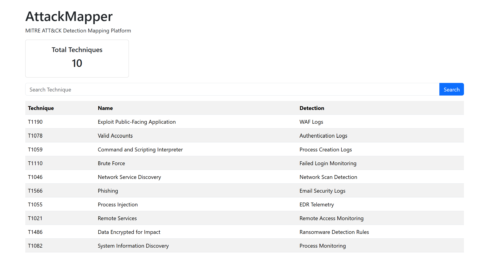

# AttackMapper

MITRE ATT&CK Detection Mapping Platform built with Python, Flask, and Bootstrap.

## Overview

AttackMapper helps security teams map MITRE ATT&CK techniques to detection sources and monitoring controls. It provides a searchable interface, technique detail pages, REST APIs, and detection coverage visibility.

## Features

- MITRE ATT&CK Technique Repository
- Technique Search
- Detection Coverage Dashboard
- Technique Detail Pages
- REST API
- Bootstrap Web Interface

## Architecture

MITRE ATT&CK Dataset
↓
Technique Repository
↓
Flask Application
↓
REST API
↓
Web Dashboard

## Dashboard Screenshot

## API Endpoints

### Get All Techniques

/api/techniques

## Technology Stack

- Python
- Flask
- Bootstrap 5
- JSON

## Project Structure

data/
templates/
screenshots/
docs/

## Current Coverage

- T1190 Exploit Public-Facing Application
- T1078 Valid Accounts
- T1059 Command and Scripting Interpreter
- T1110 Brute Force
- T1046 Network Service Discovery
- T1566 Phishing
- T1055 Process Injection
- T1021 Remote Services
- T1486 Data Encrypted for Impact
- T1082 System Information Discovery

## Future Roadmap

- ATT&CK Tactic Mapping
- Technique Relationships
- Detection Coverage Analytics
- ATT&CK Navigator Export
- SQLite Backend
- Authentication

